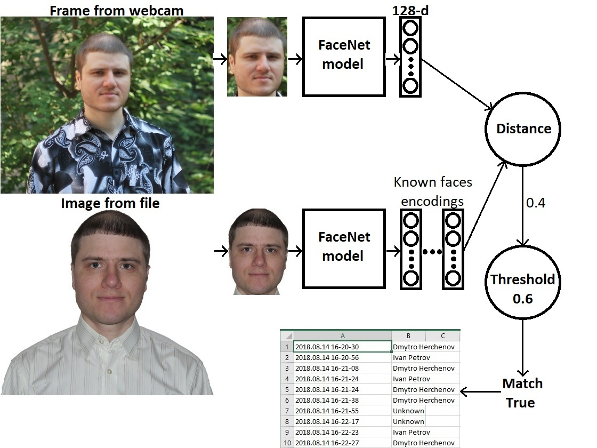
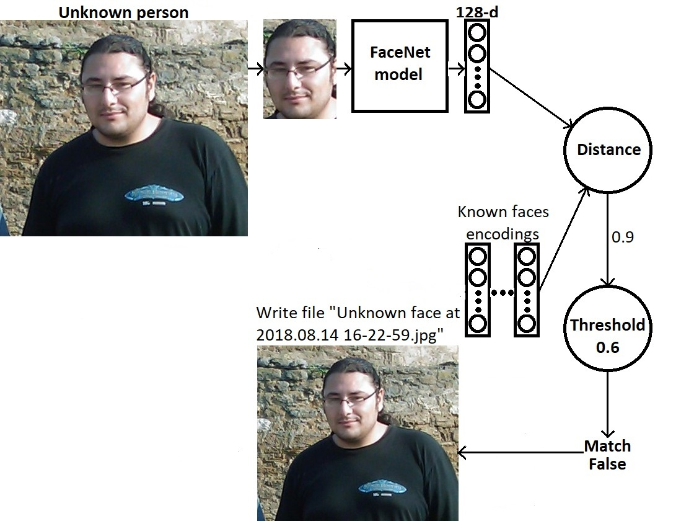
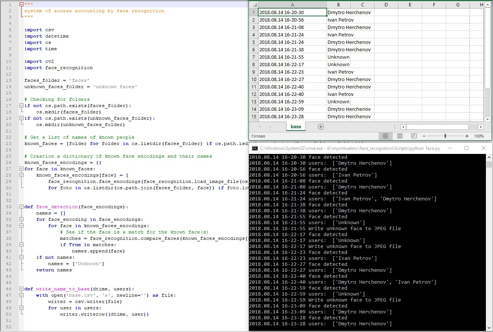

# System of access accounting by face recognition

## Details

  * Face recognition library
  * Built using dlib’s state-of-the-art face recognition built with deep learning
  * The model has an accuracy of 99.38% on the Labeled Faces in the Wild benchmark
  * Built in Python
  * Computer Vision OpenCV for work with webcam

The system is used to recognize people who come in an object and enter their names into the database with information about the date and time. In the "faces" directory, you need to create a folder for each employee with his name and put a lot of their photos in different angles for better recognition. The program reads each image and return a dictionary of 128-dimensional faces encodings. When workers come in an object, script find all the faces and faces encodings in the current frame of video of webcam. The program compares the dictionary of known faces encodings against candidates encodings to see if they match and then enter their names into the database with information about the date and time. If they do not match, the script writes unknown faces to JPEG files in 'unknown faces' folder.

## Requirements

  * Python 3.3+
  * macOS, Linux, Windows
  * modules: face_recognition, dlib, OpenCV
